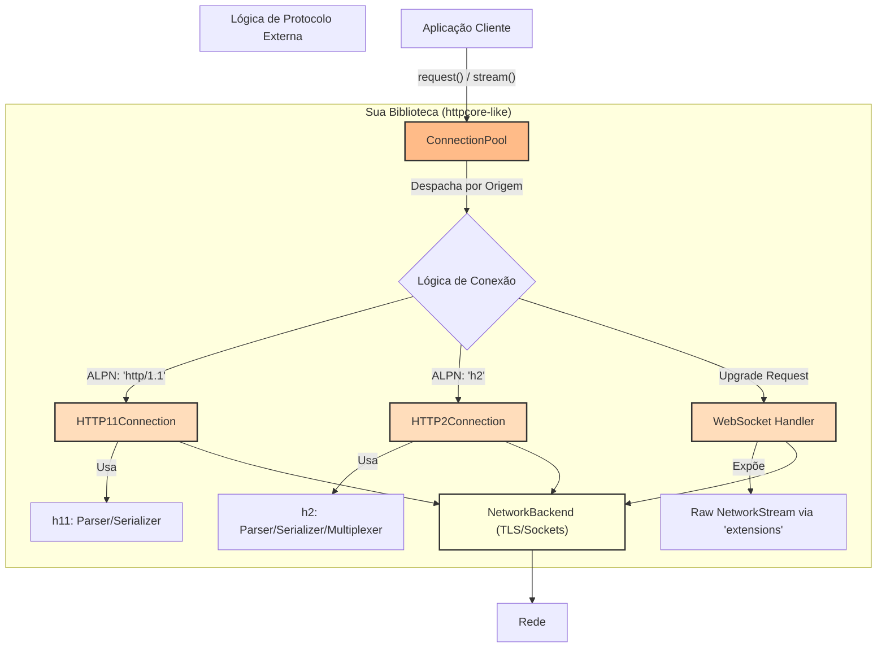

Com certeza. Com base na sua análise detalhada do `httpcore` e `httpx`, preparei um plano de implementação abrangente e estruturado para você construir sua própria biblioteca de transporte HTTP, focada em alta performance com HTTP/2 e suporte para WebSockets e Server-Sent Events (SSE).

Este plano assume que você está partindo de uma base similar à `py_async_lib` que você mencionou, com um loop de eventos assíncrono já funcional e abstrações de stream de baixo nível. A filosofia será a mesma do `httpcore`: criar uma camada de transporte minimalista, robusta e reutilizável.

### Filosofia do Projeto: "Faça uma Coisa e Faça-a Bem"

O objetivo não é criar um cliente HTTP completo como o `httpx`, mas sim o **motor** de transporte subjacente. Focaremos exclusivamente em:

1.  Gerenciamento de conexões (pooling).
2.  Lógica de protocolo (HTTP/1.1, HTTP/2).
3.  Tratamento de upgrades de protocolo (WebSockets).
4.  Exposição de streams de baixo nível para o cliente de alto nível.

---

## Plano de Implementação Detalhado

### Etapa 1: Fundação Sólida com um Cliente HTTP/1.1 Completo

**Objetivo:** Antes de abordar o HTTP/2, é crucial ter uma implementação HTTP/1.1 robusta e testada. Ela servirá de base e fallback para todas as operações.

**Descrição Técnica:**

1.  **Estrutura de Requisição/Resposta:** Crie classes `Request` e `Response` imutáveis para representar os dados de forma clara (método, URL, headers, corpo).
2.  **Abstração de Conexão:** Crie uma classe `HTTP11Connection` que gerencia um único socket. Ela será responsável por:
    *   Serializar um objeto `Request` em bytes formatados para HTTP/1.1.
    *   Enviar os bytes pela stream de rede.
    *   Ler os bytes da resposta e passá-los para um parser.
3.  **Parser HTTP/1.1:** Integre a biblioteca `h11`. Não reinvente a roda. Sua `HTTP11Connection` irá alimentar a máquina de estados do `h11` com dados do socket e reagir aos eventos (`ResponseReceived`, `Data`, `EndOfMessage`) que ela emite.
4.  **Streaming:** Garanta que os corpos de requisição e resposta sejam tratados como iteráveis (síncronos ou assíncronos), para não carregar arquivos grandes na memória.
5.  **Gerenciamento de Conexão (Keep-Alive):** Implemente a lógica para reutilizar a conexão se a resposta incluir `Connection: keep-alive`. Após uma resposta ser completamente lida, a conexão deve ser marcada como `IDLE`.

**Componentes Criados:**

*   `http_primitives.py`: Com as classes `Request` e `Response`.
*   `http11.py`: Com a classe `HTTP11Connection` que utiliza `h11`.
*   `streams.py`: Com abstrações para os corpos de requisição/resposta.

**Estratégia de Teste:**

*   Crie testes unitários para a `HTTP11Connection` usando um `MockNetworkStream`.
*   Teste contra um servidor real (como o `httpbin.org`) para validar GET, POST (com corpo), e o tratamento de `Content-Length` e `Transfer-Encoding: chunked`.
*   Verifique se a conexão é corretamente fechada (`Connection: close`) ou mantida viva.

**Critérios de Aceitação:**

*   Capacidade de realizar qualquer tipo de requisição HTTP/1.1.
*   Suporte completo a streaming de corpos de requisição e resposta.
*   Gerenciamento correto de keep-alive.

### Etapa 2: Pool de Conexões (Connection Pool)

**Objetivo:** Gerenciar múltiplas conexões para otimizar o desempenho em requisições concorrentes, espelhando a funcionalidade principal do `httpcore.ConnectionPool`.

**Descrição Técnica:**

1.  **Classe `ConnectionPool`:** Será o principal ponto de entrada da biblioteca.
2.  **Lógica de Gerenciamento:**
    *   Manterá um dicionário de conexões ativas, agrupadas por origem (`scheme`, `host`, `port`).
    *   Ao receber uma requisição, verificará se existe uma conexão `IDLE` para a origem de destino. Se sim, irá reutilizá-la.
    *   Se não houver conexões ociosas, mas o limite (`max_connections`) não foi atingido, criará uma nova conexão.
    *   Se o limite for atingido, a requisição ficará em uma fila aguardando uma conexão ser liberada.
3.  **Segurança de Concorrência:** A estrutura de dados do pool deve ser protegida contra acessos concorrentes (usando `asyncio.Lock` ou similar).

**Componentes Criados:**

*   `pool.py`: Com a classe `ConnectionPool`.
*   Interface `ConnectionInterface`: Um contrato que `HTTP11Connection` e, futuramente, `HTTP2Connection` devem implementar (`handle_request`, `is_idle`, `is_closed`, `has_expired`).

**Estratégia de Teste:**

*   Teste de concorrência: dispare múltiplas requisições simultâneas para o mesmo host e verifique se o número de conexões não ultrapassa `max_connections`.
*   Teste de reutilização: faça requisições sequenciais para o mesmo host e verifique (via logs ou mocks) que a mesma conexão foi reutilizada.
*   Teste de expiração: configure um `keepalive_expiry` baixo e verifique se as conexões ociosas são fechadas após o tempo determinado.

**Critérios de Aceitação:**

*   O pool gerencia conexões de forma eficiente, respeitando os limites configurados.
*   As requisições são enfileiradas e processadas corretamente sob alta carga.

### Etapa 3: Suporte a HTTPS e Negociação de Protocolo (ALPN)

**Objetivo:** Adicionar suporte a TLS para requisições `https://` e, crucialmente, implementar a negociação de protocolo (ALPN) para preparar o terreno para o HTTP/2.

**Descrição Técnica:**

1.  **Integração TLS:** Na sua camada de `NetworkBackend`, ao criar um socket para uma origem `https`, envolva-o com um `ssl.SSLContext`. O handshake TLS deve ser feito de forma não-bloqueante.
2.  **Implementação de ALPN:**
    *   Use `ssl_context.set_alpn_protocols(['h2', 'http/1.1'])` antes de iniciar o handshake.
    *   Após o handshake, verifique o protocolo negociado com `ssl_socket.selected_alpn_protocol()`.
3.  **Lógica de Despacho:** A `ConnectionPool`, após estabelecer a conexão, decidirá qual implementação de conexão instanciar (`HTTP11Connection` ou `HTTP2Connection`) com base no resultado do ALPN.

**Componentes Afetados:**

*   `ConnectionPool`: Adicionada a lógica para instanciar a conexão correta.
*   `NetworkBackend`: Lógica para realizar o handshake TLS com ALPN.

**Estratégia de Teste:**

*   Conecte-se a um servidor HTTPS que suporte HTTP/2 (ex: `google.com`) e verifique se `selected_alpn_protocol()` retorna `'h2'`.
*   Conecte-se a um servidor que só suporte HTTP/1.1 (ex: `httpbin.org`) e verifique se o fallback funciona corretamente.

**Critérios de Aceitação:**

*   Requisições HTTPS funcionam corretamente.
*   A biblioteca identifica corretamente o suporte a HTTP/2 do servidor via ALPN.

### Etapa 4: Implementação do Cliente HTTP/2

**Objetivo:** Implementar o fluxo de comunicação HTTP/2, aproveitando suas vantagens de multiplexação.

**Descrição Técnica:**

1.  **Integração da Biblioteca `h2`:** Assim como `httpcore`, use a biblioteca `h2` para gerenciar a máquina de estados do protocolo HTTP/2.
2.  **Classe `HTTP2Connection`:**
    *   Gerenciará uma única conexão TCP, mas múltiplos *streams* lógicos.
    *   **Inicialização:** Após a conexão ser estabelecida, enviará o *preface* do HTTP/2 e um frame `SETTINGS` inicial.
    *   **Envio de Requisição:** Para cada `handle_request`, ela irá:
        *   Obter um novo `stream_id` da máquina de estados `h2`.
        *   Converter os cabeçalhos HTTP/1.1 para o formato de pseudo-cabeçalhos do HTTP/2 (`:method`, `:path`, etc.).
        *   Enviar um frame `HEADERS` nesse stream.
        *   Enviar o corpo da requisição em um ou mais frames `DATA`.
    *   **Recebimento de Respostas (Multiplexação):** Esta é a parte mais complexa. A `HTTP2Connection` deve ter um loop de leitura contínuo que:
        *   Lê dados brutos do socket.
        *   Alimenta `h2_state.receive_data()`.
        *   Processa os eventos retornados (`ResponseReceived`, `DataReceived`, `StreamEnded`, `WindowUpdated`).
        *   Despacha cada evento para a tarefa/corrotina que está aguardando a resposta daquele `stream_id` específico. Um dicionário `stream_id -> Future/Queue` é uma boa abordagem.
3.  **Controle de Fluxo:** Implemente o envio de frames `WINDOW_UPDATE` para sinalizar ao servidor que você consumiu dados e está pronto para receber mais.

**Componentes Criados:**

*   `http2.py`: Com a classe `HTTP2Connection` que utiliza `h2`.

**Estratégia de Teste:**

*   Teste de multiplexação: dispare, de forma concorrente, várias requisições através de uma única `HTTP2Connection` e garanta que todas as respostas cheguem corretamente e sem mistura de dados.
*   Teste de controle de fluxo: faça o download de um arquivo grande e verifique se os frames `WINDOW_UPDATE` estão sendo enviados.

**Critérios de Aceitação:**

*   Múltiplas requisições são enviadas e recebidas concorrentemente sobre uma única conexão TCP.
*   A biblioteca interage corretamente com servidores HTTP/2 do mundo real.

### Etapa 5: Suporte a WebSockets

**Objetivo:** Habilitar a funcionalidade de WebSocket através do mecanismo de upgrade do HTTP/1.1.

**Descrição Técnica:**

1.  **Detecção de Upgrade:** A requisição inicial de WebSocket é uma requisição HTTP/1.1 GET com cabeçalhos especiais (`Upgrade: websocket`, `Connection: Upgrade`).
2.  **Tratamento da Resposta 101:** Se o servidor responder com `101 Switching Protocols`, a biblioteca deve:
    *   Parar de usar o parser `h11`.
    *   Expor a `NetworkStream` (o socket bruto) para a aplicação cliente. A filosofia do `httpcore` é usar o dicionário `extensions` na `Response` para isso: `response.extensions["network_stream"]`.
3.  **Framing de WebSocket:** A sua biblioteca de transporte **não** deve ser responsável por interpretar os frames do WebSocket. Ela apenas fornece o canal de comunicação. A aplicação cliente de alto nível (equivalente ao `httpx`) usaria uma biblioteca como a `wsproto` (dos mesmos autores do `h11`/`h2`) para lidar com o framing, pings/pongs, etc.

**Componentes Afetados:**

*   `HTTP11Connection`: Lógica para tratar a resposta `101` e expor a stream de rede.

**Estratégia de Teste:**

*   Crie um teste que se conecta a um servidor de echo WebSocket.
*   Verifique se a resposta `101` é recebida.
*   Use `wsproto` para enviar uma mensagem pela stream exposta e verifique se a mesma mensagem é recebida de volta.

**Critérios de Aceitação:**

*   A biblioteca gerencia com sucesso o handshake de upgrade do WebSocket.
*   A stream de rede subjacente é corretamente exposta para a aplicação cliente após o upgrade.

### Etapa 6: Suporte a Server-Sent Events (SSE)

**Objetivo:** Permitir que clientes recebam fluxos de eventos do servidor.

**Descrição Técnica:**

*   Do ponto de vista da camada de transporte, SSE é simplesmente uma requisição HTTP/1.1 normal que resulta em uma resposta com streaming que permanece aberta por um longo tempo.
*   A sua implementação de streaming do **Etapa 1** já deve ser suficiente para suportar SSE. A chave é que a corrotina `iter_stream()` da `Response` continue produzindo chunks enquanto a conexão estiver aberta.
*   A responsabilidade de *parsear* o formato `data: ...\n\n` dos eventos SSE pertence à camada de cliente (equivalente ao `httpx`), não à camada de transporte.

**Componentes Afetados:**

*   Nenhum. Esta etapa valida que a arquitetura de streaming está correta.

**Estratégia de Teste:**

*   Conecte-se a um endpoint SSE de teste.
*   Itere sobre `response.iter_stream()` e verifique se os chunks de eventos são recebidos continuamente.

**Critérios de Aceitação:**

*   A biblioteca pode manter uma conexão aberta indefinidamente para receber dados de streaming, suportando o caso de uso de SSE.

---

### Diagrama Arquitetural Final

Este diagrama ilustra como os diferentes componentes se encaixam:

Seguindo este plano, você construirá uma biblioteca poderosa, modular e de alto desempenho, aplicando as mesmas lições de design que tornam o `httpcore` tão eficaz. Boa sorte no desenvolvimento